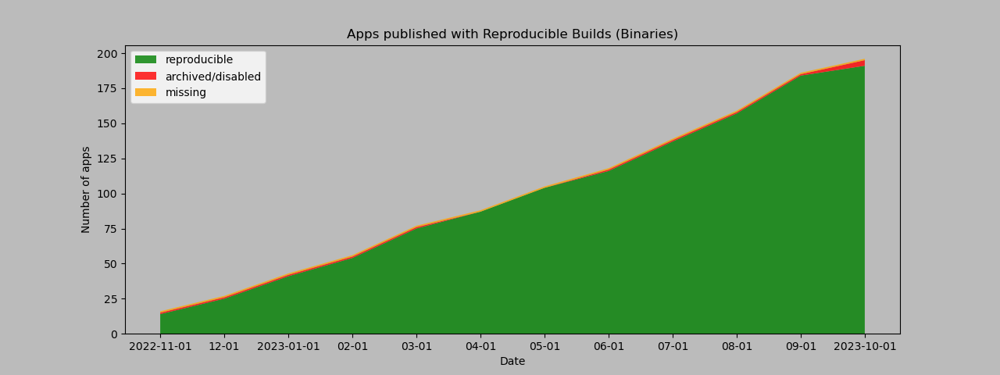

# Overview of F-Droid apps published with Reproducible Builds

Publishing apps with Reproducible Builds: https://f-droid.org/docs/Reproducible_Builds/  
Verification builds: https://f-droid.org/docs/Verification_Server/  
Scripts and data: https://github.com/obfusk/fdroid-misc-scripts  
Last updated: 2023-07-02

Description: graph "Apps published with Reproducible Builds (all)",
showing an almost straight line from 20 apps on 2022-11-01 to 144 apps
on 2023-07-01.

### Signatures in metadata: publishing both (upstream) developer-signed and F-Droid-signed APKs

#### {2022-{11,12},2023-{01,02,03,04}}-01: 6 apps

All apps (includes 1 no longer RB, making 7):

* [`de.schildbach.wallet`](https://f-droid.org/packages/de.schildbach.wallet)
* [`de.schildbach.wallet_test`](https://f-droid.org/packages/de.schildbach.wallet_test)
* [`dev.obfusk.jiten`](https://f-droid.org/packages/dev.obfusk.jiten)
* [`dev.obfusk.jiten_webview`](https://f-droid.org/packages/dev.obfusk.jiten_webview)
* [`dev.obfusk.sokobang`](https://f-droid.org/packages/dev.obfusk.sokobang)
* [`org.schabi.newpipe`](https://f-droid.org/packages/org.schabi.newpipe) [no longer RB]
* [`org.torproject.torservices`](https://f-droid.org/packages/org.torproject.torservices)

#### 2023-{05,06,07}-01: 7 apps

All apps (NewPipe is RB again, making 7):

* [`de.schildbach.wallet`](https://f-droid.org/packages/de.schildbach.wallet)
* [`de.schildbach.wallet_test`](https://f-droid.org/packages/de.schildbach.wallet_test)
* [`dev.obfusk.jiten`](https://f-droid.org/packages/dev.obfusk.jiten)
* [`dev.obfusk.jiten_webview`](https://f-droid.org/packages/dev.obfusk.jiten_webview)
* [`dev.obfusk.sokobang`](https://f-droid.org/packages/dev.obfusk.sokobang)
* [`org.schabi.newpipe`](https://f-droid.org/packages/org.schabi.newpipe)
* [`org.torproject.torservices`](https://f-droid.org/packages/org.torproject.torservices)

### Binaries: exclusively publishing (upstream) developer-signed APKs

#### 2022-11-01: 14 apps

All apps (includes 1 missing and 1 disabled, making 16):

* [`androdns.android.leetdreams.ch.androdns`](https://f-droid.org/packages/androdns.android.leetdreams.ch.androdns)
* [`ch.admin.bag.covidcertificate.verifier`](https://f-droid.org/packages/ch.admin.bag.covidcertificate.verifier)
* [`ch.admin.bag.covidcertificate.wallet`](https://f-droid.org/packages/ch.admin.bag.covidcertificate.wallet)
* [`com.markuspage.android.certtools`](https://f-droid.org/packages/com.markuspage.android.certtools) [missing]
* [`com.mishiranu.dashchan`](https://f-droid.org/packages/com.mishiranu.dashchan)
* [`de.corona.tracing`](https://f-droid.org/packages/de.corona.tracing)
* [`de.schildbach.oeffi`](https://f-droid.org/packages/de.schildbach.oeffi)
* [`eu.bubu1.fdroidclassic`](https://f-droid.org/packages/eu.bubu1.fdroidclassic)
* [`info.guardianproject.checkey`](https://f-droid.org/packages/info.guardianproject.checkey)
* [`nya.kitsunyan.foxydroid`](https://f-droid.org/packages/nya.kitsunyan.foxydroid)
* [`org.briarproject.briar.android`](https://f-droid.org/packages/org.briarproject.briar.android)
* [`org.jellyfin.androidtv`](https://f-droid.org/packages/org.jellyfin.androidtv) [disabled]
* [`org.jellyfin.mobile`](https://f-droid.org/packages/org.jellyfin.mobile)
* [`rs.ltt.android`](https://f-droid.org/packages/rs.ltt.android)
* [`top.fumiama.copymanga`](https://f-droid.org/packages/top.fumiama.copymanga)
* [`uk.co.keepawayfromfire.screens`](https://f-droid.org/packages/uk.co.keepawayfromfire.screens)

#### 2022-12-01: 25 apps (+ 11)

Newly added (none were removed):

* [`com.dhaval.bookland`](https://f-droid.org/packages/com.dhaval.bookland)
* [`com.github.bmx666.appcachecleaner`](https://f-droid.org/packages/com.github.bmx666.appcachecleaner) [signflinger]
* [`com.rafapps.earthviewformuzei`](https://f-droid.org/packages/com.rafapps.earthviewformuzei) [signflinger]
* [`com.zionhuang.music`](https://f-droid.org/packages/com.zionhuang.music)
* [`dev.yashgarg.qbit`](https://f-droid.org/packages/dev.yashgarg.qbit)
* [`io.github.project_kaat.gpsdrelay`](https://f-droid.org/packages/io.github.project_kaat.gpsdrelay)
* [`io.github.quillpad`](https://f-droid.org/packages/io.github.quillpad) [signflinger]
* [`me.gloeckl.fallasleep`](https://f-droid.org/packages/me.gloeckl.fallasleep)
* [`me.mudkip.moememos`](https://f-droid.org/packages/me.mudkip.moememos)
* [`org.joinmastodon.android`](https://f-droid.org/packages/org.joinmastodon.android) [signflinger]
* [`ru.ikkui.achie`](https://f-droid.org/packages/ru.ikkui.achie)

Signed with [`signflinger`](https://github.com/obfusk/apksigcopier#what-about-apks-signed-by-gradlezipflingersignflinger-instead-of-apksigner): 4 apps.

#### 2023-01-01: 41 apps (+ 16)

Newly added (none were removed):

* [`app.mlauncher`](https://f-droid.org/packages/app.mlauncher)
* [`com.akshayaap.mouseremote`](https://f-droid.org/packages/com.akshayaap.mouseremote) [signflinger]
* [`com.artikus.nolauncher`](https://f-droid.org/packages/com.artikus.nolauncher) [signflinger]
* [`com.dosse.clock31`](https://f-droid.org/packages/com.dosse.clock31) [signflinger]
* [`com.eurokonverter`](https://f-droid.org/packages/com.eurokonverter) [signflinger]
* [`com.github.cvzi.wallpaperexport`](https://f-droid.org/packages/com.github.cvzi.wallpaperexport) [signflinger]
* [`com.jroddev.android_oss_release_tracker`](https://f-droid.org/packages/com.jroddev.android_oss_release_tracker)
* [`com.martinmimigames.tinymusicplayer`](https://f-droid.org/packages/com.martinmimigames.tinymusicplayer) [signflinger]
* [`de.niendo.ImapNotes3`](https://f-droid.org/packages/de.niendo.ImapNotes3)
* [`dev.bartuzen.qbitcontroller`](https://f-droid.org/packages/dev.bartuzen.qbitcontroller) [signflinger]
* [`eu.auct.twitter2nitter`](https://f-droid.org/packages/eu.auct.twitter2nitter) [signflinger]
* [`nl.tsmeets.todotree`](https://f-droid.org/packages/nl.tsmeets.todotree)
* [`org.afrikalan.tuxmath`](https://f-droid.org/packages/org.afrikalan.tuxmath)
* [`org.asafonov.blockbuster`](https://f-droid.org/packages/org.asafonov.blockbuster)
* [`org.asafonov.monly`](https://f-droid.org/packages/org.asafonov.monly)
* [`org.greatfire.wikiunblocked.fdroid`](https://f-droid.org/packages/org.greatfire.wikiunblocked.fdroid) [signflinger]

Signed with [`signflinger`](https://github.com/obfusk/apksigcopier#what-about-apks-signed-by-gradlezipflingersignflinger-instead-of-apksigner): 14 apps.

#### 2023-02-01: 54 apps (+ 13)

Newly added (none were removed):

* [`InfinityLoop1309.NewPipeEnhanced`](https://f-droid.org/packages/InfinityLoop1309.NewPipeEnhanced) [signflinger]
* [`com.akansh.fileserversuit`](https://f-droid.org/packages/com.akansh.fileserversuit) [signflinger]
* [`com.nima.demomusix`](https://f-droid.org/packages/com.nima.demomusix) [signflinger]
* [`com.nima.taskmanager`](https://f-droid.org/packages/com.nima.taskmanager)
* [`com.nima.wikianime`](https://f-droid.org/packages/com.nima.wikianime) [signflinger]
* [`com.paranoiaworks.unicus.android.sse`](https://f-droid.org/packages/com.paranoiaworks.unicus.android.sse) [signflinger]
* [`com.razeeman.util.simpletimetracker`](https://f-droid.org/packages/com.razeeman.util.simpletimetracker) [signflinger]
* [`com.starry.myne`](https://f-droid.org/packages/com.starry.myne)
* [`de.andicodes.vergissnix`](https://f-droid.org/packages/de.andicodes.vergissnix)
* [`deltazero.amarok.foss`](https://f-droid.org/packages/deltazero.amarok.foss)
* [`io.github.yamin8000.dooz`](https://f-droid.org/packages/io.github.yamin8000.dooz) [signflinger]
* [`org.localsend.localsend_app`](https://f-droid.org/packages/org.localsend.localsend_app) [signflinger]
* [`yetzio.yetcalc`](https://f-droid.org/packages/yetzio.yetcalc) [signflinger]

Signed with [`signflinger`](https://github.com/obfusk/apksigcopier#what-about-apks-signed-by-gradlezipflingersignflinger-instead-of-apksigner): 23 apps.

#### 2023-03-01: 75 apps (+ 21)

Newly added (none were removed):

* [`com.akshayaap.touchdroid`](https://f-droid.org/packages/com.akshayaap.touchdroid) [signflinger]
* [`com.cyb3rko.pincredible`](https://f-droid.org/packages/com.cyb3rko.pincredible) [signflinger]
* [`com.github.vatbub.scoreboard`](https://f-droid.org/packages/com.github.vatbub.scoreboard) [signflinger]
* [`com.lijukay.quotesAltDesign`](https://f-droid.org/packages/com.lijukay.quotesAltDesign)
* [`com.nima.guessthatpokemon`](https://f-droid.org/packages/com.nima.guessthatpokemon) [signflinger]
* [`com.nima.mymood`](https://f-droid.org/packages/com.nima.mymood) [signflinger]
* [`com.zhenxiang.superimage`](https://f-droid.org/packages/com.zhenxiang.superimage)
* [`de.chadenas.cpudefense`](https://f-droid.org/packages/de.chadenas.cpudefense) [signflinger]
* [`de.westnordost.streetcomplete.expert`](https://f-droid.org/packages/de.westnordost.streetcomplete.expert) [signflinger]
* [`dev.datlag.burningseries`](https://f-droid.org/packages/dev.datlag.burningseries)
* [`eu.darken.capod`](https://f-droid.org/packages/eu.darken.capod)
* [`eu.zimbelstern.tournant`](https://f-droid.org/packages/eu.zimbelstern.tournant)
* [`gq.kirmanak.mealient`](https://f-droid.org/packages/gq.kirmanak.mealient)
* [`in.sunilpaulmathew.ashell`](https://f-droid.org/packages/in.sunilpaulmathew.ashell)
* [`org.dianqk.ruslin`](https://f-droid.org/packages/org.dianqk.ruslin)
* [`org.fcitx.fcitx5.android`](https://f-droid.org/packages/org.fcitx.fcitx5.android)
* [`ru.tech.imageresizershrinker`](https://f-droid.org/packages/ru.tech.imageresizershrinker)
* [`tk.hack5.treblecheck`](https://f-droid.org/packages/tk.hack5.treblecheck) [signflinger]
* [`ua.com.radiokot.lnaddr2invoice`](https://f-droid.org/packages/ua.com.radiokot.lnaddr2invoice) [signflinger]
* [`ua.syt0r.kanji.fdroid`](https://f-droid.org/packages/ua.syt0r.kanji.fdroid)
* [`website.leifs.delta.foss`](https://f-droid.org/packages/website.leifs.delta.foss)

Signed with [`signflinger`](https://github.com/obfusk/apksigcopier#what-about-apks-signed-by-gradlezipflingersignflinger-instead-of-apksigner): 32 apps.

#### 2023-04-01: 86 apps (+ 11)

Newly added (none were removed):

* [`com.bnyro.translate`](https://f-droid.org/packages/com.bnyro.translate) [signflinger]
* [`com.dessalines.thumbkey`](https://f-droid.org/packages/com.dessalines.thumbkey) [signflinger]
* [`com.julij.arsovreme`](https://f-droid.org/packages/com.julij.arsovreme) [signflinger]
* [`com.netvor.settings.database.provider`](https://f-droid.org/packages/com.netvor.settings.database.provider)
* [`com.vitorpamplona.amethyst`](https://f-droid.org/packages/com.vitorpamplona.amethyst)
* [`com.w2sv.wifiwidget`](https://f-droid.org/packages/com.w2sv.wifiwidget)
* [`de.ritscher.simplemobiletools.contacts.pro`](https://f-droid.org/packages/de.ritscher.simplemobiletools.contacts.pro) [signflinger]
* [`de.szalkowski.activitylauncher.rustore_fork`](https://f-droid.org/packages/de.szalkowski.activitylauncher.rustore_fork) [signflinger]
* [`io.github.zyrouge.symphony`](https://f-droid.org/packages/io.github.zyrouge.symphony)
* [`org.mindshub.insigno`](https://f-droid.org/packages/org.mindshub.insigno)
* [`player.phonograph.plus`](https://f-droid.org/packages/player.phonograph.plus)

#### 2023-05-01: 103 apps (+ 17)

Newly added (none were removed):

* [`com.cyb3rko.pazzword`](https://f-droid.org/packages/com.cyb3rko.pazzword) [signflinger]
* [`com.hexbit.rutmath`](https://f-droid.org/packages/com.hexbit.rutmath) [signflinger]
* [`com.kaajjo.libresudoku`](https://f-droid.org/packages/com.kaajjo.libresudoku)
* [`com.thatsmanmeet.taskyapp`](https://f-droid.org/packages/com.thatsmanmeet.taskyapp)
* [`com.wireguard.android`](https://f-droid.org/packages/com.wireguard.android)
* [`de.foodsharing.app`](https://f-droid.org/packages/de.foodsharing.app) [signflinger]
* [`development.parkenulm`](https://f-droid.org/packages/development.parkenulm)
* [`io.github.deweyreed.timer.other`](https://f-droid.org/packages/io.github.deweyreed.timer.other) [signflinger]
* [`io.github.muntashirakon.captiveportalcontroller`](https://f-droid.org/packages/io.github.muntashirakon.captiveportalcontroller) [signflinger]
* [`io.github.v2compose`](https://f-droid.org/packages/io.github.v2compose)
* [`net.viggers.zade.wallpaper`](https://f-droid.org/packages/net.viggers.zade.wallpaper)
* [`nl.privacydragon.bookwyrm`](https://f-droid.org/packages/nl.privacydragon.bookwyrm) [signflinger]
* [`org.cryptomator.lite`](https://f-droid.org/packages/org.cryptomator.lite)
* [`org.jshobbysoft.cameraalign`](https://f-droid.org/packages/org.jshobbysoft.cameraalign)
* [`timur.webcall.callee`](https://f-droid.org/packages/timur.webcall.callee) [signflinger]
* [`ua.com.radiokot.photoprism`](https://f-droid.org/packages/ua.com.radiokot.photoprism) [signflinger]
* [`xyz.apiote.bimba.czwek`](https://f-droid.org/packages/xyz.apiote.bimba.czwek) [signflinger]

#### 2023-06-01: 116 apps (+ 14, - 1)

Newly added:

* [`com.amnesica.clearclipboard`](https://f-droid.org/packages/com.amnesica.clearclipboard)
* [`com.amnesica.kryptey`](https://f-droid.org/packages/com.amnesica.kryptey)
* [`com.atul.musicplayer`](https://f-droid.org/packages/com.atul.musicplayer) [signflinger]
* [`com.certified.audionote`](https://f-droid.org/packages/com.certified.audionote) [signflinger]
* [`com.gaika.bilketa`](https://f-droid.org/packages/com.gaika.bilketa) [signflinger]
* [`com.gokadzev.musify.fdroid`](https://f-droid.org/packages/com.gokadzev.musify.fdroid)
* [`com.prostudio.urltopdfconverter`](https://f-droid.org/packages/com.prostudio.urltopdfconverter) [signflinger]
* [`de.tu_chemnitz.etit.sse.openstop`](https://f-droid.org/packages/de.tu_chemnitz.etit.sse.openstop) [signflinger]
* [`dev.lbeernaert.youhavemail`](https://f-droid.org/packages/dev.lbeernaert.youhavemail)
* [`eu.mokrzycki.learndigits`](https://f-droid.org/packages/eu.mokrzycki.learndigits)
* [`github.umer0586.sensorserver`](https://f-droid.org/packages/github.umer0586.sensorserver) [signflinger]
* [`io.github.freewatermark.mobileapp`](https://f-droid.org/packages/io.github.freewatermark.mobileapp) [signflinger]
* [`io.github.friesi23.mhabit`](https://f-droid.org/packages/io.github.friesi23.mhabit) [signflinger]
* [`s1m.savertuner`](https://f-droid.org/packages/s1m.savertuner)

No longer RB:

* [`org.joinmastodon.android`](https://f-droid.org/packages/org.joinmastodon.android) [signflinger]

#### 2023-07-01: 137 apps (+ 21)

Newly added (none were removed):

* [`com.agateau.burgerparty`](https://f-droid.org/packages/com.agateau.burgerparty) [signflinger]
* [`com.codelv.inventory`](https://f-droid.org/packages/com.codelv.inventory)
* [`com.craftxbox.yubiclip.xor`](https://f-droid.org/packages/com.craftxbox.yubiclip.xor)
* [`com.dede.android_eggs`](https://f-droid.org/packages/com.dede.android_eggs) [signflinger]
* [`com.donnnno.arcticons.you`](https://f-droid.org/packages/com.donnnno.arcticons.you)
* [`com.flauschcode.broccoli`](https://f-droid.org/packages/com.flauschcode.broccoli)
* [`com.github.lamarios.clipious`](https://f-droid.org/packages/com.github.lamarios.clipious) [signflinger]
* [`com.github.muellerma.nfcreader`](https://f-droid.org/packages/com.github.muellerma.nfcreader)
* [`com.github.ttl.manager`](https://f-droid.org/packages/com.github.ttl.manager)
* [`com.kolserdav.ana`](https://f-droid.org/packages/com.kolserdav.ana) [signflinger]
* [`com.lighttigerxiv.simple.mp`](https://f-droid.org/packages/com.lighttigerxiv.simple.mp)
* [`com.maze_squirrel`](https://f-droid.org/packages/com.maze_squirrel) [signflinger]
* [`com.nyx.custom_uploader`](https://f-droid.org/packages/com.nyx.custom_uploader) [signflinger]
* [`com.sdcardstoryteller`](https://f-droid.org/packages/com.sdcardstoryteller)
* [`com.spencerpages`](https://f-droid.org/packages/com.spencerpages) [signflinger]
* [`com.wirelessalien.zipxtract`](https://f-droid.org/packages/com.wirelessalien.zipxtract) [signflinger]
* [`de.ptrlx.oneshot`](https://f-droid.org/packages/de.ptrlx.oneshot)
* [`dev.develsinthedetails.eatpoopyoucat`](https://f-droid.org/packages/dev.develsinthedetails.eatpoopyoucat) [signflinger]
* [`io.github.teccheck.fastlyrics`](https://f-droid.org/packages/io.github.teccheck.fastlyrics) [signflinger]
* [`org.fcitx.fcitx5.android.plugin.anthy`](https://f-droid.org/packages/org.fcitx.fcitx5.android.plugin.anthy)
* [`org.proninyaroslav.opencomicvine`](https://f-droid.org/packages/org.proninyaroslav.opencomicvine) [signflinger]

---

Total number of apps using RB: 7 + 137 = 144.

---

### More graphs

Description: graph "New apps (not 100% accurate)", showing new apps
added per month from 2022-11-01 to 2023-07-01, with an average of
about 25 new apps per month, with the fraction of those being
reproducible rising from about half to almost three quarters.

Description: graph "Removed apps (not 100% accurate)", showing apps
removed added per month from 2022-11-01 to 2023-07-01, with most
months seeing about 1-5 apps removed, and 3 months with 10-14 removed.

Description: graph "F-Droid apps (not 100% accurate)", showing the
total number of apps per month from 2022-11-01 to 2023-07-01, about
4000, slowly increasing over time, and the fraction of those being
reproducible rising from almost none to about 4%.

Description: graph "Apps published with Reproducible Builds
(signatures in metadata)", showing 6 apps on 2022-11-01, and 7 apps on
2023-07-01.

Description: graph "Apps published with Reproducible Builds
(Binaries)", showing an almost straight line from 14 apps on
2022-11-01 to 137 apps on 2023-07-01.
