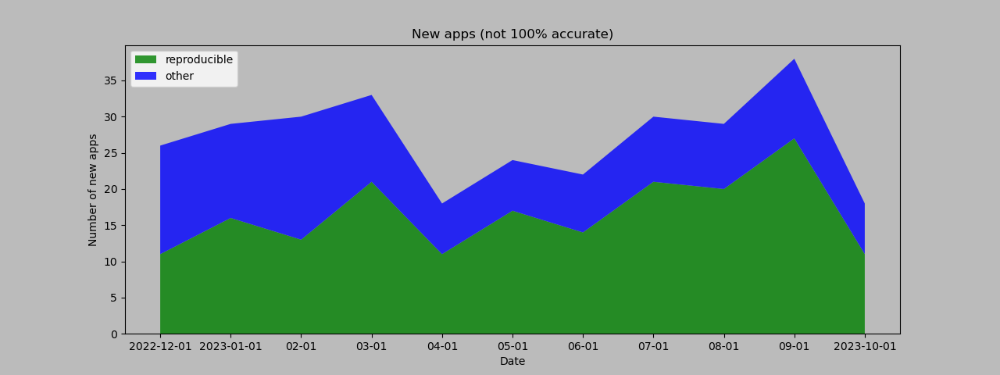
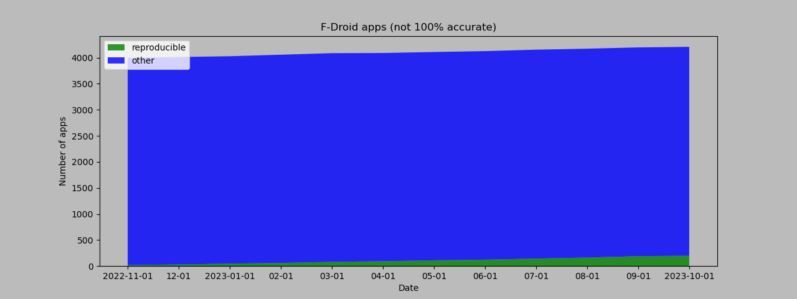

# Overview of F-Droid apps published with Reproducible Builds

Publishing apps with Reproducible Builds: https://f-droid.org/docs/Reproducible_Builds/  
Verification builds: https://f-droid.org/docs/Verification_Server/  
Scripts and data: https://github.com/obfusk/fdroid-misc-scripts  
Last updated: 2023-07-02


Description: graph "Apps published with Reproducible Builds (all)",
showing an almost straight line from 20 apps on 2022-11-01 to 144 apps
on 2023-07-01.

### Signatures in metadata: publishing both (upstream) developer-signed and F-Droid-signed APKs

#### {2022-{11,12},2023-{01,02,03,04}}-01: 6 apps

All apps (includes 1 no longer RB, making 7):

<details>

```
de.schildbach.wallet
de.schildbach.wallet_test
dev.obfusk.jiten
dev.obfusk.jiten_webview
dev.obfusk.sokobang
org.schabi.newpipe [no longer RB]
org.torproject.torservices
```

</details>

#### 2023-{05,06,07}-01: 7 apps

All apps (NewPipe is RB again, making 7):

<details>

```
de.schildbach.wallet
de.schildbach.wallet_test
dev.obfusk.jiten
dev.obfusk.jiten_webview
dev.obfusk.sokobang
org.schabi.newpipe
org.torproject.torservices
```

</details>

### Binaries: exclusively publishing (upstream) developer-signed APKs

#### 2022-11-01: 14 apps

All apps (includes 1 missing and 1 disabled, making 16):

<details>

```
androdns.android.leetdreams.ch.androdns
ch.admin.bag.covidcertificate.verifier
ch.admin.bag.covidcertificate.wallet
com.markuspage.android.certtools [missing]
com.mishiranu.dashchan
de.corona.tracing
de.schildbach.oeffi
eu.bubu1.fdroidclassic
info.guardianproject.checkey
nya.kitsunyan.foxydroid
org.briarproject.briar.android
org.jellyfin.androidtv [disabled]
org.jellyfin.mobile
rs.ltt.android
top.fumiama.copymanga
uk.co.keepawayfromfire.screens
```

</details>

#### 2022-12-01: 25 apps (+ 11)

Newly added (none were removed):

<details>

```
com.dhaval.bookland
com.github.bmx666.appcachecleaner [signflinger]
com.rafapps.earthviewformuzei [signflinger]
com.zionhuang.music
dev.yashgarg.qbit
io.github.project_kaat.gpsdrelay
io.github.quillpad [signflinger]
me.gloeckl.fallasleep
me.mudkip.moememos
org.joinmastodon.android [signflinger]
ru.ikkui.achie
```

</details>

Signed with [`signflinger`](https://github.com/obfusk/apksigcopier#what-about-apks-signed-by-gradlezipflingersignflinger-instead-of-apksigner): 4 apps.

#### 2023-01-01: 41 apps (+ 16)

Newly added (none were removed):

<details>

```
app.mlauncher
com.akshayaap.mouseremote [signflinger]
com.artikus.nolauncher [signflinger]
com.dosse.clock31 [signflinger]
com.eurokonverter [signflinger]
com.github.cvzi.wallpaperexport [signflinger]
com.jroddev.android_oss_release_tracker
com.martinmimigames.tinymusicplayer [signflinger]
de.niendo.ImapNotes3
dev.bartuzen.qbitcontroller [signflinger]
eu.auct.twitter2nitter [signflinger]
nl.tsmeets.todotree
org.afrikalan.tuxmath
org.asafonov.blockbuster
org.asafonov.monly
org.greatfire.wikiunblocked.fdroid [signflinger]
```

</details>

Signed with [`signflinger`](https://github.com/obfusk/apksigcopier#what-about-apks-signed-by-gradlezipflingersignflinger-instead-of-apksigner): 14 apps.

#### 2023-02-01: 54 apps (+ 13)

Newly added (none were removed):

<details>

```
InfinityLoop1309.NewPipeEnhanced [signflinger]
com.akansh.fileserversuit [signflinger]
com.nima.demomusix [signflinger]
com.nima.taskmanager
com.nima.wikianime [signflinger]
com.paranoiaworks.unicus.android.sse [signflinger]
com.razeeman.util.simpletimetracker [signflinger]
com.starry.myne
de.andicodes.vergissnix
deltazero.amarok.foss
io.github.yamin8000.dooz [signflinger]
org.localsend.localsend_app [signflinger]
yetzio.yetcalc [signflinger]
```

</details>

Signed with [`signflinger`](https://github.com/obfusk/apksigcopier#what-about-apks-signed-by-gradlezipflingersignflinger-instead-of-apksigner): 23 apps.

#### 2023-03-01: 75 apps (+ 21)

Newly added (none were removed):

<details>

```
com.akshayaap.touchdroid [signflinger]
com.cyb3rko.pincredible [signflinger]
com.github.vatbub.scoreboard [signflinger]
com.lijukay.quotesAltDesign
com.nima.guessthatpokemon [signflinger]
com.nima.mymood [signflinger]
com.zhenxiang.superimage
de.chadenas.cpudefense [signflinger]
de.westnordost.streetcomplete.expert [signflinger]
dev.datlag.burningseries
eu.darken.capod
eu.zimbelstern.tournant
gq.kirmanak.mealient
in.sunilpaulmathew.ashell
org.dianqk.ruslin
org.fcitx.fcitx5.android
ru.tech.imageresizershrinker
tk.hack5.treblecheck [signflinger]
ua.com.radiokot.lnaddr2invoice [signflinger]
ua.syt0r.kanji.fdroid
website.leifs.delta.foss
```

</details>

Signed with [`signflinger`](https://github.com/obfusk/apksigcopier#what-about-apks-signed-by-gradlezipflingersignflinger-instead-of-apksigner): 32 apps.

#### 2023-04-01: 86 apps (+ 11)

Newly added (none were removed):

<details>

```
com.bnyro.translate [signflinger]
com.dessalines.thumbkey [signflinger]
com.julij.arsovreme [signflinger]
com.netvor.settings.database.provider
com.vitorpamplona.amethyst
com.w2sv.wifiwidget
de.ritscher.simplemobiletools.contacts.pro [signflinger]
de.szalkowski.activitylauncher.rustore_fork [signflinger]
io.github.zyrouge.symphony
org.mindshub.insigno
player.phonograph.plus
```

</details>

#### 2023-05-01: 103 apps (+ 17)

Newly added (none were removed):

<details>

```
com.cyb3rko.pazzword [signflinger]
com.hexbit.rutmath [signflinger]
com.kaajjo.libresudoku
com.thatsmanmeet.taskyapp
com.wireguard.android
de.foodsharing.app [signflinger]
development.parkenulm
io.github.deweyreed.timer.other [signflinger]
io.github.muntashirakon.captiveportalcontroller [signflinger]
io.github.v2compose
net.viggers.zade.wallpaper
nl.privacydragon.bookwyrm [signflinger]
org.cryptomator.lite
org.jshobbysoft.cameraalign
timur.webcall.callee [signflinger]
ua.com.radiokot.photoprism [signflinger]
xyz.apiote.bimba.czwek [signflinger]
```

</details>

#### 2023-06-01: 116 apps (+ 14, - 1)

Newly added:

<details>

```
com.amnesica.clearclipboard
com.amnesica.kryptey
com.atul.musicplayer [signflinger]
com.certified.audionote [signflinger]
com.gaika.bilketa [signflinger]
com.gokadzev.musify.fdroid
com.prostudio.urltopdfconverter [signflinger]
de.tu_chemnitz.etit.sse.openstop [signflinger]
dev.lbeernaert.youhavemail
eu.mokrzycki.learndigits
github.umer0586.sensorserver [signflinger]
io.github.freewatermark.mobileapp [signflinger]
io.github.friesi23.mhabit [signflinger]
s1m.savertuner
```

</details>

No longer RB:

<details>

```
org.joinmastodon.android [signflinger]
```

</details>

#### 2023-07-01: 137 apps (+ 21)

Newly added (none were removed):

<details>

```
com.agateau.burgerparty [signflinger]
com.codelv.inventory
com.craftxbox.yubiclip.xor
com.dede.android_eggs [signflinger]
com.donnnno.arcticons.you
com.flauschcode.broccoli
com.github.lamarios.clipious [signflinger]
com.github.muellerma.nfcreader
com.github.ttl.manager
com.kolserdav.ana [signflinger]
com.lighttigerxiv.simple.mp
com.maze_squirrel [signflinger]
com.nyx.custom_uploader [signflinger]
com.sdcardstoryteller
com.spencerpages [signflinger]
com.wirelessalien.zipxtract [signflinger]
de.ptrlx.oneshot
dev.develsinthedetails.eatpoopyoucat [signflinger]
io.github.teccheck.fastlyrics [signflinger]
org.fcitx.fcitx5.android.plugin.anthy
org.proninyaroslav.opencomicvine [signflinger]
```

</details>

---

Total number of apps using RB: 7 + 137 = 144.

---

### More graphs



Description: graph "New apps (not 100% accurate)", showing new apps
added per month from 2022-11-01 to 2023-07-01, with an average of
about 25 new apps per month, with the fraction of those being
reproducible rising from about half to almost three quarters.


Description: graph "Removed apps (not 100% accurate)", showing apps
removed added per month from 2022-11-01 to 2023-07-01, with most
months seeing about 1-5 apps removed, and 3 months with 10-14 removed.



Description: graph "F-Droid apps (not 100% accurate)", showing the
total number of apps per month from 2022-11-01 to 2023-07-01, about
4000, slowly increasing over time, and the fraction of those being
reproducible rising from almost none to about 4%.


Description: graph "Apps published with Reproducible Builds
(signatures in metadata)", showing 6 apps on 2022-11-01, and 7 apps on
2023-07-01.


Description: graph "Apps published with Reproducible Builds
(Binaries)", showing an almost straight line from 14 apps on
2022-11-01 to 137 apps on 2023-07-01.
